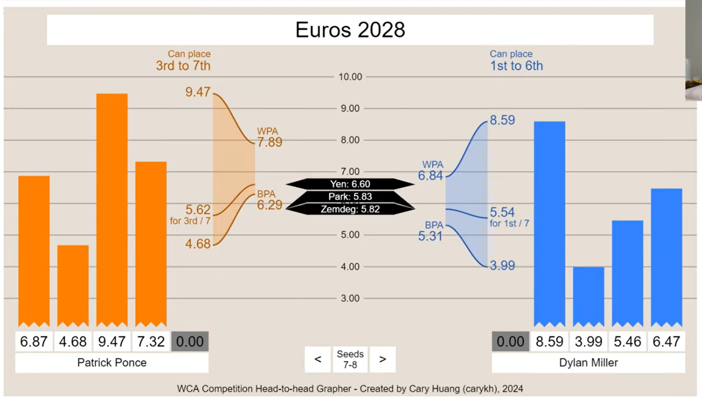

# Head-to-head grapher!

For WCA competitions. Draws a side-by-side graph of competitor's final round results to see what their WPA/BPA are.

View the HTH grapher in action here: https://htwins.net/hthgrapher

Watch my video explaining the project here: https://www.youtube.com/watch?v=92Dg-iV5o0c

# Disclaimer

Note: This was a casual coding project I did over a couple days, so there's no guarantee it calculates correctly in all edge cases. In particular, there are a few edge cases it gets wrong: Such as when Competitor A gets 5.00, 5.00, 5.00, 6.00 and 4.00, and Competitor B gets 5.00, 5.00, 5.00, and 5.00. In this situation, both averages are guaranteed to be 5.00, so it's the single best time that decides who wins. So, Competitor B needs a single time of 3.99 or better to win! However, since B's BPA and WPA are both 5.00, this program thinks the range of possible outcomes is only 5.00 - 5.00, and thinks that Competitor B is destined to lose. That's incorrect. However, weird edge cases like this *should* only occur when the averages tie. If the averages are even 0.01 different, this program should work correctly!

Feel free to make pull requests that fix these bugs, if you'd like. Also, feel free to use this program in your own competitions, videos, websites, and whatever else! I don't feel any possessiveness over this program, so it's free to be shared amongst the world in any way people like.
